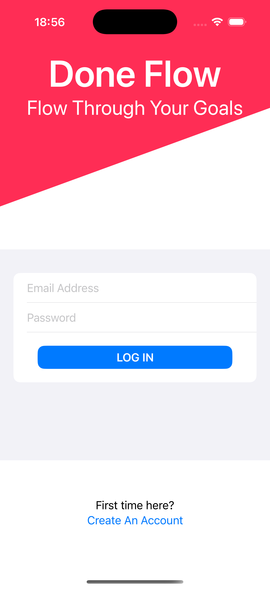
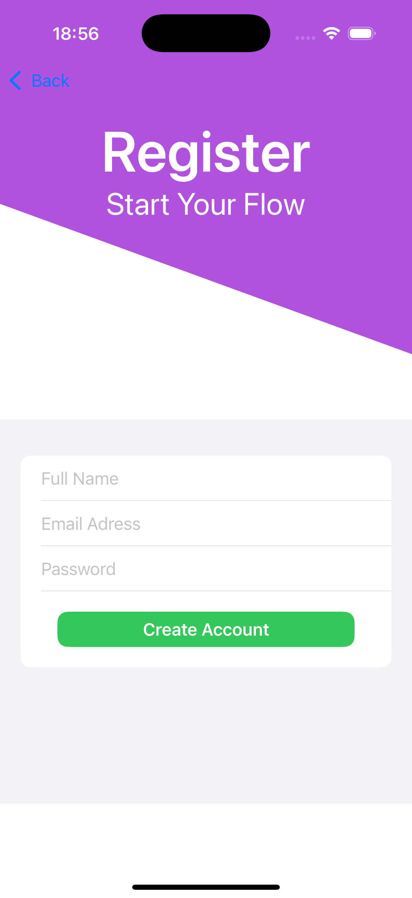
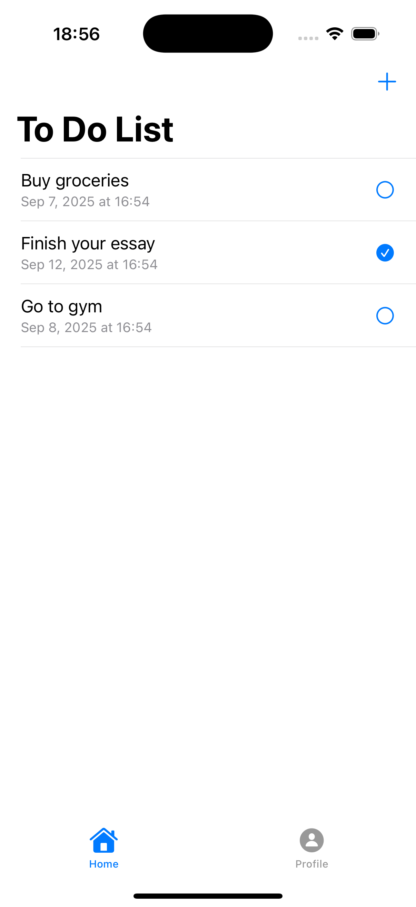
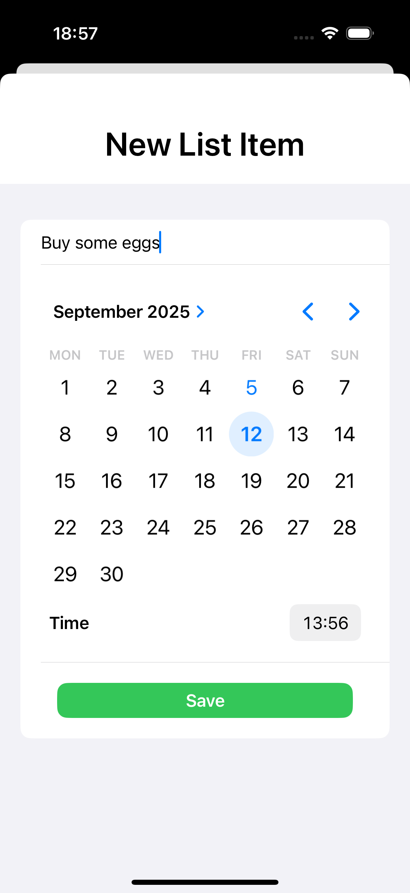
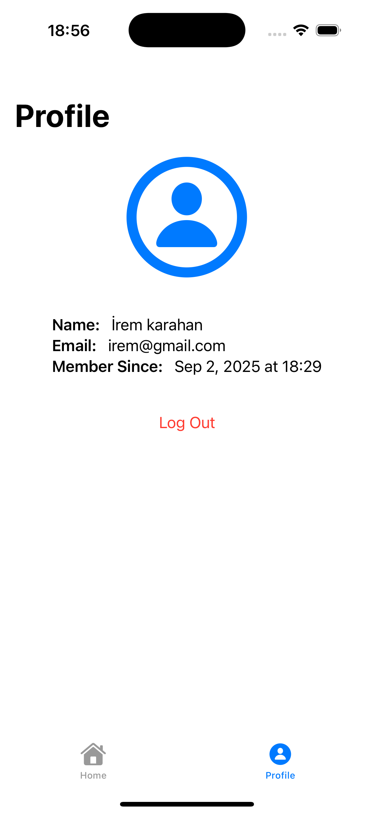
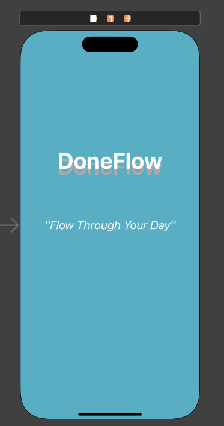

# DoneFlowApp 

A **SwiftUI-based task management application** designed to provide a seamless and intuitive to-do list experience.  
DoneFlow allows users to authenticate securely, create tasks with precise deadlines and manage their daily workflow efficiently.  

---

## ✨ Features

- **Authentication**
  - Secure sign-up and sign-in with Firebase Authentication.
- **Task Management**
  - Create to-do items with titles.
  - Assign exact deadlines (**date, hour, and minute**) via a built-in calendar and time picker.
  - Mark tasks as completed.
  - Delete tasks when they are no longer needed.
- **Cloud Integration**
  - Real-time synchronization with Firebase Firestore.
  - Persistent data accessible across devices.

---

## 🛠️ Technology Stack

- **Language:** Swift  
- **Framework:** SwiftUI  
- **State Management:** `@State`, `@StateObject`, `@FirestoreQuery`  
- **Backend & Database:** Firebase Firestore  
- **Authentication:** Firebase Auth  

---

## 📸 Screenshots

 

  <h4>Authentication</h4>
  

    
    
  

 

  

    <h4>Task List</h4>
    
  

  

    <h4>New List Item</h4>
    
  

  

    <h4>Profile View</h4>
    
  

  

    <h4>Launch Screen</h4>
    
  

---

